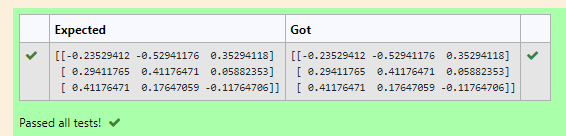

# INVERSE-OF-A-MATRIX
## Aim:
To write a python program to find the inverse of a matrix
## Equipment’s required:
1. 	Hardware – PCs
2. 	Anaconda – Python 3.7 Installation / Moodle-Code Runner
## Algorithm:
### Step1 : 
import numpy as np
### Step 2: 
assign in np.array()in inverse of a matrix
### Step 3: 
using the np.linalg.inv(),we can find the inverse of a matrix
### Step 4:
add the coding and end the program 

## Program:
```
#program to find the inverse of the matrix
#Developed by:Monisha T
#registernumber:21500314
import numpy as np 
A = np.array ([[1,0,3],[-1,2,-2],[2,3,-1]])
values = np.linalg.inv(A)
print(values)

```

## Output:

## Result:
Thus the inverse of given matrix is successfully solved using python program

